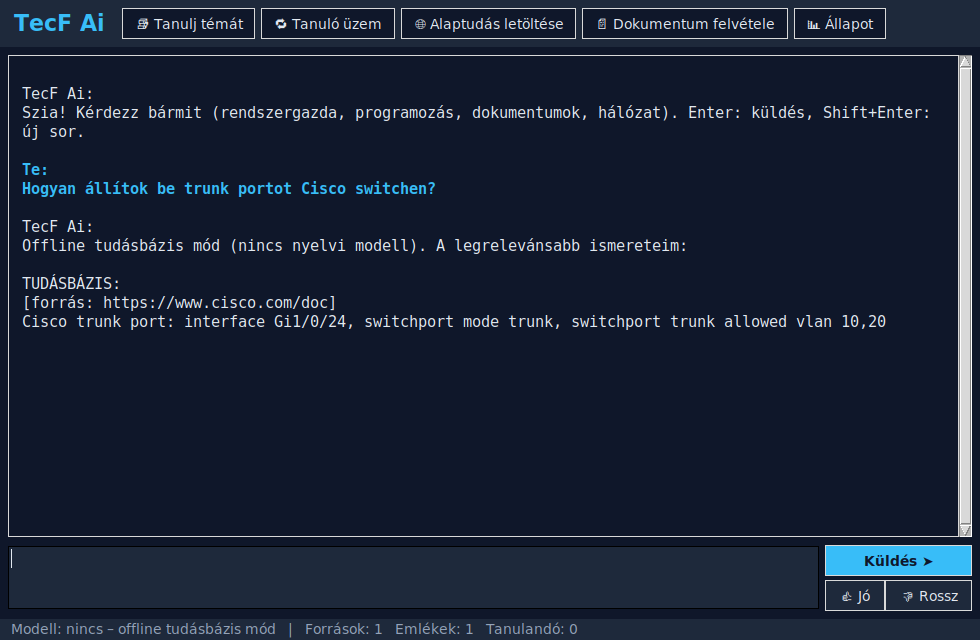

# TecF Ai – saját, offline is működő, önállóan tanuló mesterséges intelligencia

A TecF Ai a saját gépeden, a **D:\TecFAi** mappában fut. Saját tudásbázisa van, internet nélkül is
működik, és folyamatosan tanul a netről, a dokumentumaidból, más AI-któl és a te értékeléseidből.

## Fő képességek

| Terület | Mit tud |
|---|---|
| 🖥️ **Rendszergazda** | PowerShell/Bash parancsok futtatása (jóváhagyással), rendszerinfó, folyamatok, AD/GPO/Linux tudás |
| 💻 **Programozó** | minden nyelven kódot ír, fájlba ment, Python kódot futtat és tesztel |
| 📄 **Dokumentumok** | olvas: PDF, Word, Excel, PowerPoint, HTML, szöveg, forráskód · készít: Markdown, HTML, Word |
| 🌐 **Internetes kutatás** | keresés (API kulcs nélkül), oldalak letöltése, a `robots.txt` szabályait betartja |
| 🔌 **Hálózati eszközök** | ping, portellenőrzés, helyi hálózat felderítése, DNS; Cisco, MikroTik, Juniper, Aruba, HP, Huawei, Fortinet, Palo Alto eszközök SSH programozása (show / configure / backup) |
| 🧠 **Önálló tanulás** | tanuló üzem, tudáshiány felismerése, tényeket von ki, altémákat keres, tanul a rossz válaszaiból |
| 🤖 **Más AI-k** | 27 szolgáltató név szerint (helyi és felhős), ezektől is tud tanulni |
| 🔗 **Saját API** | OpenAI-kompatibilis helyi szerver, így más programok is használhatják |



## Telepítés (Windows, D: meghajtó)

1. Töltsd le a projektet (GitHub: **Code → Download ZIP**), és csomagold ki.
2. Kattints duplán a **`TELEPITES.bat`** fájlra (rendszergazdai jogot kér).
3. A végén az asztalon és a Start menüben megjelenik a **TecF Ai** ikon.

Haladóknak ugyanez PowerShellből, kapcsolókkal:

```powershell
Set-ExecutionPolicy -Scope Process Bypass
.\scripts\install_windows.ps1 -NightlyLearning
```

A telepítő a következőket végzi el:
1. telepíti a Pythont, ha még nincs fent
2. a programot a `D:\TecFAi\app` mappába másolja, és saját Python környezetet hoz létre (`D:\TecFAi\venv`)
3. telepíti az **Ollamát**, és a gép RAM-jához illő legjobb nyílt modellt tölti le (a modellek is a D:-re kerülnek):
   - ≥48 GB: `qwen3:32b` · ≥24 GB: `qwen3:14b` · ≥12 GB: `qwen3:8b` · egyébként: `qwen3:4b`
4. `tecf init`: létrehozza a mappákat és feltölti a tanulási sort az alap tantervvel
5. **`tecf bootstrap`: letölti az alaptudást a legjobb elérhető hiteles forrásokból** (lásd lent)
6. `-NightlyLearning` kapcsolóval minden éjjel 02:00-kor 90 percig tanul
7. asztali és Start menü ikont hoz létre („TecF Ai”), amely az ablakos programot indítja

Kapcsolók: `-Target E:\TecFAi` (más meghajtó), `-NoOllama`, `-NoBootstrap`.

## Alaptudás: a legjobb elérhető források

A `tecf bootstrap` parancs a netről a legmegbízhatóbb, elsődleges forrásokat tölti le. Ezek magas
megbízhatósági pontszámot kapnak, így a keresésnél előnyt élveznek a sima weboldalakkal szemben:

| Terület | Források |
|---|---|
| Programozás | Python tutorial és HOWTO-k, MDN JavaScript Guide, TypeScript Handbook, Microsoft C# tour, The Rust Book, Effective Go, dev.java, cppreference, PostgreSQL tutorial, Pro Git könyv, GNU Bash kézikönyv, PowerShell dokumentáció, OWASP Top 10 |
| Rendszergazda | Microsoft Learn: AD DS, Windows Server hibaelhárítás, hálózati szolgáltatások · Arch Wiki · Ubuntu Server docs · systemd |
| Hálózat | **25 RFC szabvány** (IPv4/IPv6, TCP, UDP, DNS, DHCP, OSPF, BGP, NAT, IPsec, IKEv2, TLS 1.3, SNMP, NTP, SSH, RADIUS, VXLAN…) · gyártói dokumentáció (Cisco, MikroTik, Juniper, Aruba, Fortinet) |
| Fogalmak | kb. 70 Wikipedia szócikk (angol és magyar) |
| Dokumentumok | Google developer documentation style guide, Write the Docs |

```
tecf bootstrap                          # minden terület (kb. 1–2 óra)
tecf bootstrap -a halozat programozas   # csak ezek a területek
tecf bootstrap --scale 0.3              # gyorsabb, kisebb alaptudás
```

Ha a futást megszakítod, az addig letöltött tudás megmarad. Újrafuttatáskor a már meglévő tartalmat
kihagyja (tartalom-hash alapján), így a paranccsal frissíteni is lehet.

**Még nagyobb offline tudásért (opcionális):** a [Kiwix](https://kiwix.org) teljes offline Wikipédiát,
Stack Overflow-t és DevDocs-ot kínál ZIM fájlokban. Ezekből HTML-t exportálva a
`tecf ingest <mappa>` paranccsal felveheted őket a tudásbázisba.

## Használat

**Ablakos program:** az asztali ikonnal indul. Írd be a kérdést, Enterrel küldöd. A 👍/👎 gombokkal
értékeled a választ (ebből tanul). A felső gombokkal indíthatod a tanulást, a tanuló üzemet és az
alaptudás letöltését, valamint itt veheted fel a dokumentumaidat.

**Parancssor** (`D:\TecFAi\tecf.bat ...`):

```
tecf                                   # ablakos program
tecf chat                              # beszélgetés (/jo /rossz /tanul <téma> /status /kilep)
tecf ask "Írj PowerShell szkriptet, ami listázza a 90 napja inaktív AD felhasználókat"
tecf learn "Cisco IOS port security"   # téma megtanulása a netről
tecf learn --loop --minutes 60         # TANULÓ ÜZEM: a tanulási sor feldolgozása
tecf learn-ai "BGP route reflector" -p anthropic openai gemini   # tanulás más AI-któl
tecf ingest D:\Dokumentumok\IT         # saját dokumentumok felvétele (alap: D:\TecFAi\inbox)
tecf teach "A DC01 a tartományvezérlő, IP 192.168.1.10"
tecf rate 42 good                      # válasz értékelése -> ebből tanul
tecf reflect                           # rossz válaszok újratanulása és újragondolása
tecf status                            # tudásbázis statisztika
tecf serve                             # helyi API: http://127.0.0.1:8765/v1/chat/completions
```

## AI szolgáltatók (név szerint)

`tecf providers` kilistázza az összeset az állapotukkal együtt. Kulcs megadása:
`tecf keys set <név> <kulcs>` (a kulcs a `D:\TecFAi\config\api_keys.json` fájlba kerül), vagy
környezeti változóval.

**Helyi (offline):** TecF saját modell, Ollama, LM Studio, llama.cpp, LocalAI, Jan
**Felhő:** Anthropic Claude, OpenAI GPT, Google Gemini, Mistral, Cohere, xAI Grok, DeepSeek, Groq,
Perplexity, Together AI, OpenRouter, Fireworks, Cerebras, Hugging Face, NVIDIA NIM, Alibaba Qwen,
Moonshot Kimi, Zhipu GLM, AI21, SambaNova, Azure OpenAI

Modell cseréje: `tecf keys set openai_model gpt-4o`, vagy egyszeri használatnál `openai:gpt-4o`.
Egyéni cím: `tecf keys set azure_url https://...`.

A `config.json` fájlban:
- `fallback_providers`: melyik felhős AI-t használja, ha a helyi modell nem fut
- `learn_from_ai_providers`: tanuló üzemben mely AI-któl kérdezzen

## Hogyan lesz egyre okosabb?

```
 kérdés ──► tudásbázis + emlékek (offline keresés) ──► modell (helyi → felhő → csak tudásbázis)
               ▲                                            │  eszközök (parancs, fájl, web, hálózat)
               │                                            ▼
   ┌───────────┴──────────────┐                        válasz ──► naplózás ──► értékelés (/jo /rossz)
   │ tanuló üzem (learn)      │◄── tudáshiány ─────────────┘                    │
   │ web · dokumentumok · AI-k│◄── rossz válasz ◄────────────────────────────────┤
   └──────────────────────────┘    jó válasz ──► tudásbázisba kerül ◄──────────┘
                                   jó válaszok ──► export (finomhangolás)
```

1. **Tudáshiány felismerése:** ha egy kérdésre nincs releváns tudása, a téma bekerül a tanulási sorba.
2. **Tanuló üzem:** keres a neten, letölti és feldarabolja az oldalakat, a modellel kivonja a
   legfontosabb tényeket, és kapcsolódó altémákat is sorba állít, így a tudása magától bővül.
3. **Visszajelzés:** a jónak értékelt válasz megbízható tudássá válik, a rossz válasz témáját pedig
   újratanulja (`tecf reflect`).
4. **Megerősítés:** az ismételten megtanult tények megbízhatósága nő, és a keresésnél előrébb kerülnek.
5. **Finomhangolás (haladó):** `tecf export tanito.jsonl` exportálja a jó válaszokat, amelyekkel
   a helyi modell LoRA-val továbbtanítható (pl. Unsloth vagy LLaMA-Factory segítségével), majd Ollamába importálható.

## Saját nyelvi modell (nulláról, a gép kapacitásához méretezve)

A TecF Ai egy **teljesen saját**, a te gépeden, a nulláról tanított nyelvi modellt is fel tud építeni.
Az ablakban ehhez a **🧬 Saját modell** gomb kell, parancssorban pedig:

```
tecf model info              # hardver felmérés, ajánlott modellméret
tecf model build --hours 8   # mindent egyben: szöveggyűjtés, tokenizáló, tanítás, beszélgetésre hangolás
tecf model test "A VLAN"     # kipróbálás
tecf model use               # a TecF Ai ezt használja (vissza: tecf model use --off)
```

**Hogyan működik:**
1. **Hardver felmérés:** a program megnézi a videokártyát (VRAM), a memóriát és a processzort, és
   kiválasztja a legnagyobb modellt, amelyet a gép még tanítani tud:

   | Méret | Paraméter | Kell hozzá |
   |---|---|---|
   | mini | ~5 millió | bármilyen gép (CPU) |
   | kicsi | ~17 millió | erős CPU (8+ mag, 16 GB RAM) vagy kis GPU |
   | kozepes | ~110 millió (GPT-2 méret) | NVIDIA 6–16 GB VRAM |
   | nagy | ~336 millió | NVIDIA 16+ GB VRAM |
   | xl | ~730 millió | NVIDIA 40+ GB VRAM |

   A méretet az adatmennyiség is korlátozza: kevés szövegen a nagy modell csak bemagolja az anyagot.
2. **Szöveggyűjtés:** a saját tudásbázis, a jónak értékelt beszélgetések, valamint nyílt, jó minőségű
   gyűjtemények: magyar és angol Wikipédia, FineWeb-2 magyar, FineWeb-Edu, Python kód, és SmolTalk
   beszélgetések a beszélgetésre hangoláshoz. Alapból kb. 2,3 GB, ez állítható:
   `tecf model corpus -s wiki-hu=1000 fineweb2-hu=2000`.
3. **Saját tokenizáló** (BPE), amely a magyar ékezetes szöveget is hatékonyan kezeli.
4. **Előtanítás** (a nyelv megtanulása), majd **beszélgetésre hangolás**. Időkerettel fut,
   folyamatosan menti az eredményt, és csak a legjobb változatot tartja meg.
5. **Folyamatos fejlődés:** a `build` újrafuttatásakor a modell onnan tanul tovább, ahol abbahagyta,
   és közben az új tudást is megtanulja. Új modell a nulláról: `--fresh`.

**Mire számíts:** a saját modell teljesen a tiéd, de egy otthoni gépen tanított modell sokkal kisebb,
mint a nagy cégek modelljei. Kicsi méretben és néhány óra tanítás után csak nyelvtanilag hasonló
szöveget ír. Egy közepes GPU-n több napig tanított kozepes modell már összefüggő magyar mondatokat
ír, de a gondolkodása messze elmarad a letöltött Qwen modellétől. Ezért a napi munkához az Ollama
modell az alapbeállítás, a saját modell pedig egy mellette fejlődő kísérlet, amelyet bármikor
bekapcsolhatsz a `tecf model use` paranccsal.

## Biztonság

- Parancsfuttatás, fájlírás és hálózati eszköz konfigurálása előtt **mindig jóváhagyást kér**
  (`confirm_system_commands`, `confirm_network_changes`).
- API szerver módban ezek a műveletek tiltva vannak, és a szerver csak a saját gépről érhető el (127.0.0.1).
- Hálózatszkennelés csak privát (saját) alhálózaton engedélyezett.
- Az API kulcsok helyben maradnak (`config\api_keys.json`), a git ezt a fájlt figyelmen kívül hagyja.
- Más AI-któl tanulásnál vedd figyelembe a szolgáltatók felhasználási feltételeit: több szolgáltató
  tiltja, hogy a kimenetükkel versenytárs modellt tanítsanak. A tudásbázisba forrásmegjelöléssel
  eltárolt referencia más kategória, mint a finomhangolás.

## Mappaszerkezet

```
D:\TecFAi\
  app\tecf\        program
  venv\             saját Python környezet
  models\           Ollama modellek (offline)
  data\knowledge.db tudásbázis (SQLite + FTS5)
  inbox\            ide másolt dokumentumokat az `ingest` feldolgozza
  output\           elkészült dokumentumok
  config\           config.json, api_keys.json
  tecf.bat         indító
```

Részletes felépítés: [docs/ARCHITEKTURA.md](docs/ARCHITEKTURA.md)

## Fejlesztés

Az alapműködéshez nincs szükség külső csomagra (csak Python 3.10+). Tesztek futtatása:

```
python -m unittest discover -s tests -v
```
